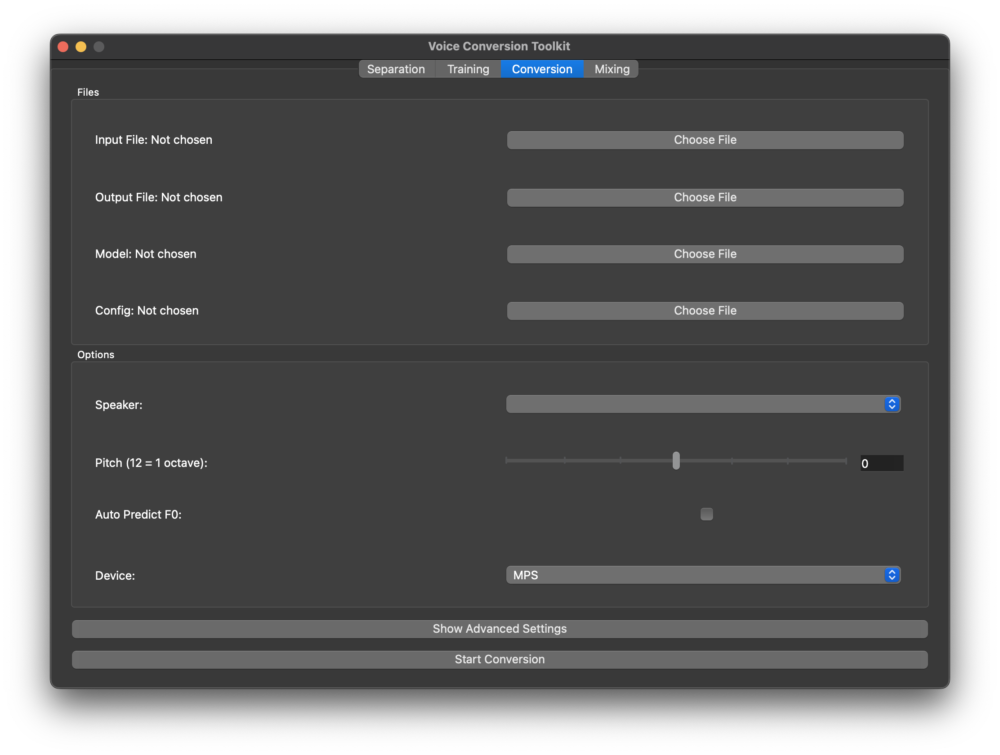
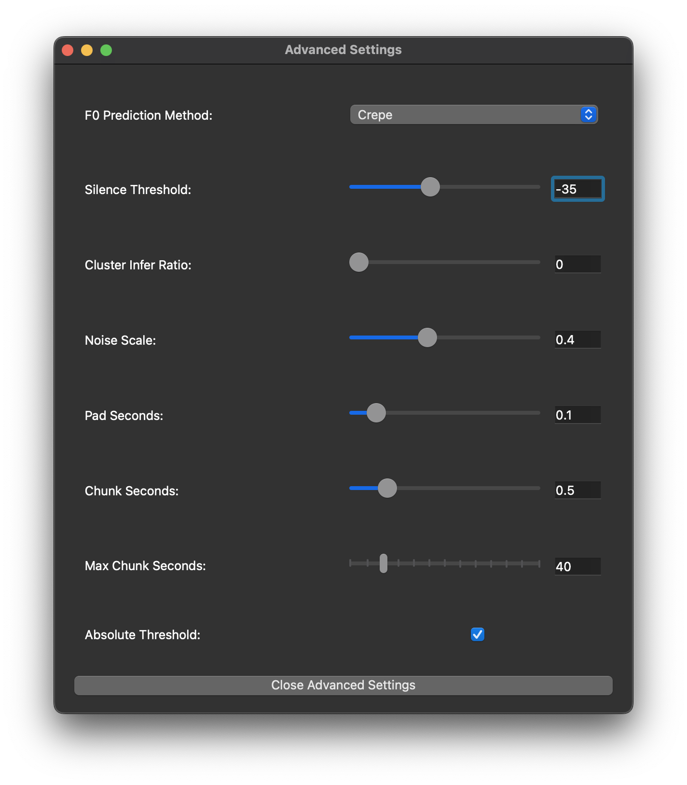

# Usage

## Starting the Application

Please install the package first before using it. For installation instructions, see [here](./installation.md).

To start the application, run the following command in the terminal:

Windows:

```
svct.exe
```

macOS/Linux:

```
svct
```

A loading screen will appear, and the application will start after a few seconds.
The screen is different depending on the operating system. In this documentation,
the macOS version is used. Though the appearance is different, the functionality
is the same on all platforms.


## Vocal Separation Tab


### Files

In this tab, you can separate the vocals from the fully mixed track. The input
file and the output directory has to be specified. The output directory is where
the separated vocals will be saved.

### Options

At least one outputting file has to be selected before starting the separation.
Model of different size can be selected, the larger the model, the better the
separation quality. However, the larger model will take more time to process.

### Device and Precision

The device can be selected to be either CPU or GPU. If the device is set to GPU,
the model will be loaded to the GPU and the separation will be done on the GPU.
It is generally faster to use the GPU, so it is recommended to use the GPU if
available. As for macOS, Metal (MPS) can be selected as the device for faster processing.

For both Metal (MPS) on macOS and NVIDIA GPU that is pre-Ampere architecture, the
BFloat16 option is not supported. The BFloat16 option is only available for
NVIDIA GPU with Ampere architecture or newer. As an alternative, the Float32
option can be used, though the quality might be slightly worse, or CPU can be
used with the same quality, but slower processing.

### Start Separation

After selecting the input file, output directory, and the options, click the
"Start Separation" button to start the separation process. The progress bar will
show the progress of the separation. The time taken for the separation depends
on the size of the input file and the selected model.

Note that the application will download the model if it is not found in the cache,
so the first time the model is used, it will take longer to start the separation,
especially if the model is large.

## Training Tab


### Preprocessing

Before the training, the dataset has to be preprocessed. The dataset should be
in the format of a directory containing the audio files. The dataset directory
has to be specified, and the output directory for the preprocessed dataset has
to be specified as well.

If the audio files are very long, the audio files can be split into smaller
segments by checking the "Split Audio Files" option.

The preprocessing can be started by clicking the "Start Preprocessing" button. The
preprocessing will take some time depending on the size of the dataset. When the
preprocessing is running, there will be an animation indicating that the
preprocessing is running.

### Training

After the dataset is preprocessed, the training can be started. The path to the
folder of the outputting model and the path to the outputting config file has to
be specified. The config file is named `config.json`, containing the training configuration,
that is generated when the dataset is preprocessed.

The training can be started by clicking the "Start Training" button. The training
will take some time depending on the size of the dataset and the selected model.
When the training is running, there will be an animation indicating that the
training is running.

## Conversion Tab



### Files

In this tab, you can convert the vocals to a different singer. The input, output,
model, and config file has to be specified. TODO: model file name

### Options

After selecting the config file, the speaker dropdown will be populated with the
speakers in the config file. The pitch of the converted vocal can be adjusted
by using the pitch slider. If the converted vocal is a speaking voice, the "Auto
Predict F0" option can be checked to automatically predict the pitch of the speaking
voice.

### Advanced Settings



The advanced settings can be used to adjust the conversion settings. Do note that
the advanced settings are for advanced users, and the default settings should work
for most cases.

### Start Conversion

The conversion can be started by clicking the "Start Conversion" button. Similar
to the training, an animation will be shown when the conversion is running. The
time taken for the conversion depends on the size of the input file.

## Mixing Tab


### Files

In this tab, you can mix the converted vocal with the instrumental. The source 1
file, source 2 file, and the output file paths have to be specified. Do note
that this tab can also be used to mix any two audio files, as long as the audio
files have the exact same sample rate, number of channels, and length.

### Options

The volume ratio of source 1 can be adjusted by using the slider. The volume ratio
is between 0 and 1. Since when mixing two audio files, the volume might be too
loud, the normalization option is checked by default to normalize the volume of
the mixed audio.

## Vocal Separation Model Training and Evaluation

**Important**: This section is for advanced users who want to train the vocal separation
model from scratch. The training and evaluation is done in the terminal. The interface
is command-line based *only*, though a GUI version might be added in the future.

Note that installing the package from source is recommended for these features, as
it is easier to locate the manifest and model files. For installation instructions,
see [here](./development.md).

The current models are trained using MUSDB18-HQ and MoisesDB datasets, with a total
of around 18 hours of training data. The resulting models are able to separate the
vocals from the fully mixed track, but if you have a larger dataset, you can train
the model and evaluate the model using the provided scripts. You are strongly encouraged
to upload the trained model to Hugging Face for others to use, if possible.

### Preprocessing

**Important**: Note that this feature is available only when installing the package
from source. Please see [Development](./development.md) for more information.

This entry point is used to generate the csv files from the downloaded MUDB18-HQ
and MoisesDB datasets. If you are using your own dataset, you should generate the
csv files in the format specified in the next section.

To preprocess the dataset, run the following command:

Windows:

```
vs-preprocess.exe
```

macOS/Linux:

```
vs-preprocess
```

The help message is as follows:

```
usage: vs-preprocess [-h] [-o CSV_OUTPUT_DIR] [-v VAL_SIZE] [-s STEM] -m MUSDB_DIR [-M MOISESDB_DIR] -w MOISESDB_WAV_DIR

Preprocess the dataset(s).

options:
  -h, --help            show this help message and exit
  -o CSV_OUTPUT_DIR, --csv_output_dir CSV_OUTPUT_DIR
                        CSV Output directory (default: ./input_csv)
  -v VAL_SIZE, --val_size VAL_SIZE
                        Validation size (default: 0.2)
  -s STEM, --stem STEM  Stem to preprocess (default: vocals)
  -m MUSDB_DIR, --musdb_dir MUSDB_DIR
                        Path to the MUSDB18 directory (required)
  -M MOISESDB_DIR, --moisesdb_dir MOISESDB_DIR
                        Path to the MoisesDB directory (optional)
  -w MOISESDB_WAV_DIR, --moisesdb_wav_dir MOISESDB_WAV_DIR
                        Path to the MoisesDB wav directory (required)
```

The `MUSDB_DIR` is the path to the MUSDB18-HQ dataset, which should contain the
`train` and `test` directories. The `MOISESDB_DIR` is the path to the MoisesDB
dataset, which should contain the `moisesd_v0.1` directory. It has to be specified
if the mixed stem audio files are not yet generated. The `MOISESDB_WAV_DIR` is the
path to the MoisesDB wav directory, which is the output directory of the MoisesDB
mixed stem audio files, and the input directory of the MoisesDB CSV files.

The `MOISESDB_DIR` has to be specified for the first time the MoisesDB dataset is
used to generate the mixed stem audio files in a similar format to the MUSDB18-HQ
dataset, and can be omitted for subsequent runs.

### Training

This entry point is used to train the vocal separation model. The training is done
using PyTorch Lightning, and the model is saved in the output directory specified.

To train the model, run the following command:

Windows:

```
vs-train.exe
```

macOS/Linux:

```
vs-train
```

The help message is as follows:

```
usage: vs-train [-h] -t TRAIN_CSV -v VAL_CSV [-e EXPERIMENT] [-m MODEL_LOG_DIR] [-c CONFIG]

Train a separation model.

options:
  -h, --help            show this help message and exit
  -t TRAIN_CSV, --train_csv TRAIN_CSV
                        Path to the training csv file (required)
  -v VAL_CSV, --val_csv VAL_CSV
                        Path to the validation csv file (required)
  -e EXPERIMENT, --experiment EXPERIMENT
                        Name of the experiment (default: exp)
  -m MODEL_LOG_DIR, --model_log_dir MODEL_LOG_DIR
                        Path to the model log directory (default: ./model_log/)
  -c CONFIG, --config CONFIG
                        Path to the config file (default: ./config.yml)
```

Note that the experiment name is used to differentiate between different experiments,
and a new directory will be created in the `MODEL_LOG_DIR` with the experiment name.
The experiment name can also be used to create nested directories, for example,
`exp1/config1`.

The CSV files should have three columns in total, all of which are strings, namely
`song`, `mixture_path`, and `stem_path`. The `song` column is the name of the song,
usually follow the format of `artist - title`. The `mixture_path` column is the path
to the mixture audio file, and the `stem_path` column is that to the stem audio file.
Any CSV file that follows this format can be used for training, even if it is not
generated using the preprocessing script.

The config file is a YAML file containing the training configuration. The format
of the config file should follow that of this example [here](https://github.com/jljl1337/svc-toolkit/blob/main/config.yml).
There are a few parameters that are worth noting: `resume_path` is the path to the
directory of the experiment to resume training from, `expand_factor` is the factor
to expand the dataset by, which should be around the length of a patch/segment.
`deeper` is the flag to train the large model.

### Evaluation

This entry point is used to evaluate the vocal separation model. The evaluation is
done on the files with their paths stored in a CSV file, and the model is loaded from
the output directory

To evaluate the model, run the following command:

Windows:

```
vs-eval.exe
```

macOS/Linux:

```
vs-eval
```

The help message is as follows:

```
usage: vs-eval [-h] -m MODEL_DIR -t TEST_CSV [-p {bf16,32}] [-l | --last | --no-last]

Evaluate a separation model.

options:
  -h, --help            show this help message and exit
  -m MODEL_DIR, --model_dir MODEL_DIR
                        Path to the model directory (required)
  -t TEST_CSV, --test_csv TEST_CSV
                        Path to the test csv file (required)
  -p {bf16,32}, --precision {bf16,32}
                        Precision (default: bf16, choices: bf16, 32)
  -l, --last, --no-last
                        Use the last model
```

The format of the CSV file is the same as the training CSV file, please refer to the
training section for more information. The precision can be selected to be either
BFloat 16 (`bf16`) or Float 32 (`32`), with BFloat 16 being the default. The last
model can be used by specifying the `--last` flag, or otherwise, the best model
(i.e. the one with the lowest validation loss) will be used.

Note that the results will be saved in the same directory as the model directory.
The results include the SDR, SI-SDR, NSDR, and NSI-SDR scores. The scores of each
song will be saved in a CSV file, and the summary of the scores will be saved in
another CSV file. A box plot of the scores will also be saved in the same directory.