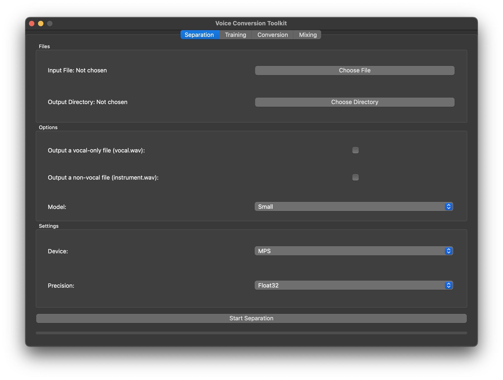
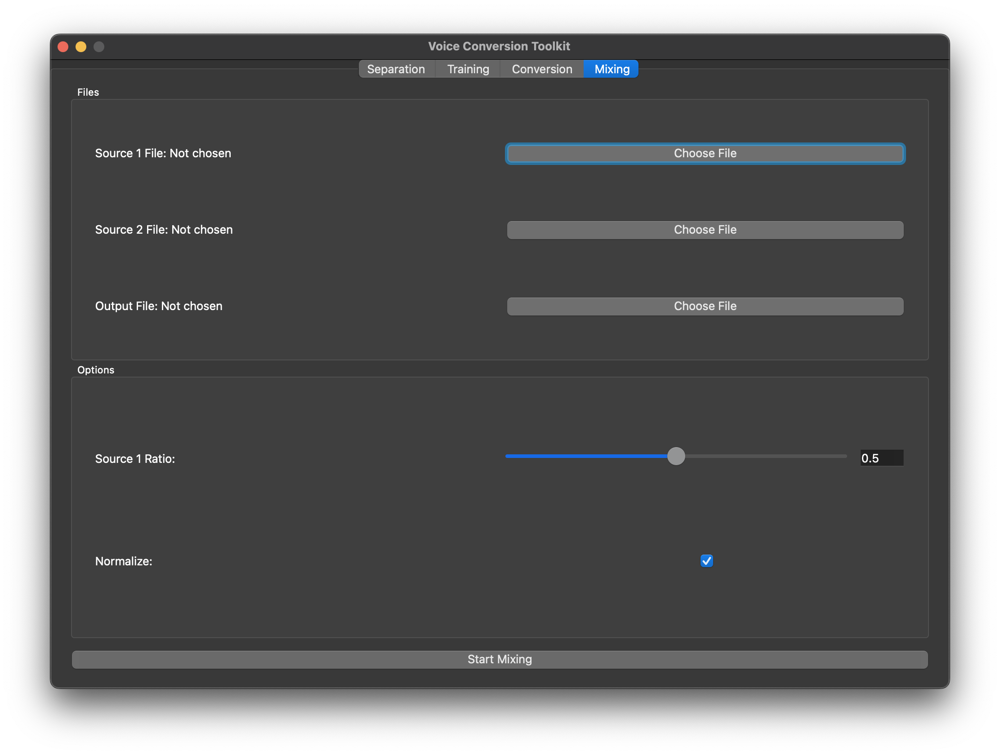

# Usage

## Starting the Application

Please install the package first before using it. For installation instructions, see [here](./installation.md).

To run the application, run the following command in the terminal:

Windows:

```
svct.exe
```

macOS/Linux:

```
svct
```

A loading screen will appear, and the application will start after a few seconds.
The screen is different depending on the operating system. In this documentation,
the macOS version is used. Though the appearance is different, the functionality
is the same on all platforms.


## Vocal Separation Tab



### Files

In this tab, you can separate the vocals from the fully mixed track. The input
file and the output directory has to be specified. The output directory is where
the separated vocals will be saved.

### Options

At least one outputting file has to be selected before starting the separation.
Model of different size can be selected, the larger the model, the better the
separation quality. However, the larger model will take more time to process.

### Device and Precision

The device can be selected to be either CPU or GPU. If the device is set to GPU,
the model will be loaded to the GPU and the separation will be done on the GPU.
It is generally faster to use the GPU, so it is recommended to use the GPU if
available. As for macOS, Metal (MPS) can be selected as the device for faster processing.

For both Metal (MPS) on macOS and NVIDIA GPU that is pre-Ampere architecture, the
BFloat16 option is not supported. The BFloat16 option is only available for
NVIDIA GPU with Ampere architecture or newer. As an alternative, the Float32
option can be used, though the quality might be slightly worse, or CPU can be
used with the same quality, but slower processing.

### Start Separation

After selecting the input file, output directory, and the options, click the
"Start Separation" button to start the separation process. The progress bar will
show the progress of the separation. The time taken for the separation depends
on the size of the input file and the selected model.

Note that the application will download the model if it is not found in the cache,
so the first time the model is used, it will take longer to start the separation,
especially if the model is large.

## Training Tab


### Preprocessing

Before the training, the dataset has to be preprocessed. The dataset should be
in the format of a directory containing the audio files. The dataset directory
has to be specified, and the output directory for the preprocessed dataset has
to be specified as well.

If the audio files are very long, the audio files can be split into smaller
segments by checking the "Split Audio Files" option.

The preprocessing can be started by clicking the "Start Preprocessing" button. The
preprocessing will take some time depending on the size of the dataset. When the
preprocessing is running, there will be an animation indicating that the
preprocessing is running.

### Training

After the dataset is preprocessed, the training can be started. The path to the
folder of the outputting model and the path to the outputting config file has to
be specified. The config file is a JSON file containing the training configuration,
that is generated when the dataset is preprocessed.

The training can be started by clicking the "Start Training" button. The training
will take some time depending on the size of the dataset and the selected model.
When the training is running, there will be an animation indicating that the
training is running.

## Conversion Tab


### Files

### Options


### Advanced Settings

### Start Conversion

## Mixing Tab



### Files

### Options

## Vocal Separation Model Training and Evaluation

### Preprocessing

### Training

### Evaluation